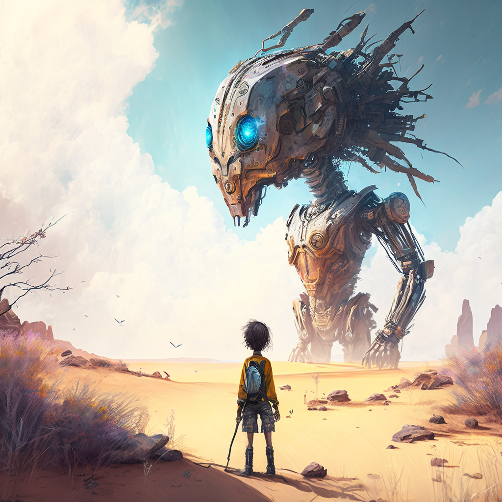
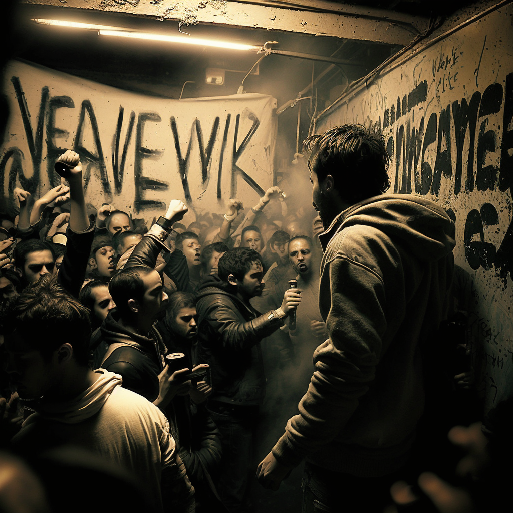
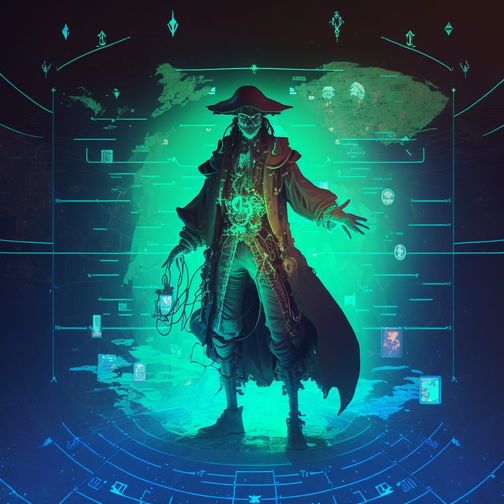

# Stealware

Welcome to the Stealware project! Stealware is an open licensing model for AI-generated content, designed to promote freedom of use, modification, and sharing of creative works. This repository serves as a reference and an example of how to apply the Stealware license to your own AI-generated projects.

## License Variations

In this repository, you'll find three different variations of the Stealware license:

1. **Stealware License**: The standard Stealware license grants permission to use, copy, modify, merge, publish, distribute, sublicense, and/or sell copies of the AI-generated work, without any limitations or restrictions. No attribution is required, although it is appreciated when possible.

   
   *Image Prompt: A futuristic robot holding a parchment scroll, symbolizing the AI-generated work and the open nature of the license.*

2. **Stealware License - Fight Club Edition**: Inspired by the movie Fight Club, this edgy variation of the Stealware license emphasizes the rebellious spirit of freedom and creativity.

   
   *Image Prompt: A street artist spray painting the words "Stealware License" on a wall in an underground fight club, with a crowd cheering in the background, showcasing the edgy atmosphere of the Fight Club-inspired license.*

3. **Stealware License - Pirate Code Edition**: This pirate-themed version of the Stealware license encourages users to freely explore the high seas of AI-generated content.

   
   *Image Prompt: A cyber pirate surrounded by holographic screens displaying AI-generated content, while standing on a digital treasure map, illustrating the adventurous spirit of the Pirate Code license.*

For the full text of each Stealware license, see the respective files in this repository:

- [Stealware License](Stealware_License)
- [Stealware License - Fight Club Edition](Stealware_License_Fight_Club_Edition)
- [Stealware License - Pirate Code Edition](Stealware_License_Pirate_Code_Edition)

## Usage

To apply one of the Stealware licenses to your own AI-generated project, follow these steps:

1. Choose the license variation that best suits your project and copy the respective file from this repository to your own project repository.
2. Replace `[Year]` and `[Copyright Holder]` placeholders with the appropriate information.
3. Include a reference to the chosen Stealware license in your project documentation or source code, as appropriate.

By applying a Stealware license to your project, you grant users the freedom to use, modify, and share your AI-generated content as they see fit.

## Contributing

We welcome contributions to improve the Stealware licenses and promote their adoption. To contribute, please submit a pull request or open an issue on GitHub.

## Contact

For any questions or suggestions about the Stealware licenses, feel free to [open an issue on GitHub](https://github.com/yourusername/stealware/issues).

## Acknowledgments

This project was made possible with the help of:

- **ChatGPT by OpenAI**: The text content, including the Stealware licenses and this README file, were generated with the assistance of ChatGPT, an AI model developed by OpenAI. For more information about ChatGPT, visit the [OpenAI website](https://www.openai.com/).
- **Midjourney AI**: The AI-generated images accompanying each license variation were created using Midjourney AI's image generation platform. To learn more about Midjourney AI and their services, check out their website at [midjourney.ai](https://www.midjourney.ai/).
